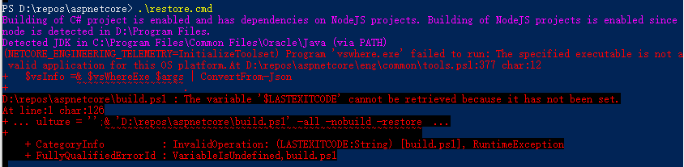

# 编译 Asp.Net Core 源码

官方文档:[Build ASP.NET Core from Source](https://github.com/dotnet/aspnetcore/blob/master/docs/BuildFromSource.md)。

## 下载源码
GitHub下载源码速度极慢，可替换为国内仓库<https://github.com.cnpmjs.org/>或<https://git.sdut.me/>，下载完成后再替换回去。

## 准备环境
参看官方文档，其中`JDK`推荐使用`Oracle's JDK`，而不是直接使用脚本，原因只有一个，就是因为慢。`Oracle's JDK`下载需要账号，不愿意注册的可以到<http://bugmenot.com/view/oracle.com>上获取。

## 切换版本
默认`master`分支为`.Net 5`预览版，需要切换到`.Net Core 3.x`(根据个人需要)
## 修改配置
1. 根据本机环境以及源码分支版本修改`global.json`，我的如下(其中`vswhere`是新增的，跟本机安装的同一个版本，可到`C:\Program Files (x86)\Microsoft Visual Studio\Installer`中查找):
``` json
{
  "sdk": {
    "version": "3.1.302"
  },
  "tools": {
    "vswhere": "2.7.1",
    "dotnet": "3.1.302",
    "runtimes": {
      "dotnet/x64": [
        "$(MicrosoftNETCoreAppInternalPackageVersion)"
      ],
      "dotnet/x86": [
        "$(MicrosoftNETCoreAppInternalPackageVersion)"
      ]
    },
    "Git": "2.22.0",
    "jdk": "11.0.6",
    "vs": {
      "version": "16.6",
      "components": [
        "Microsoft.VisualStudio.Component.VC.ATL",
        "Microsoft.VisualStudio.Component.VC.Tools.x86.x64",
        "Microsoft.VisualStudio.Component.Windows10SDK.17134"
      ]
    }
  },
  "msbuild-sdks": {
    "Yarn.MSBuild": "1.15.2",
    "Microsoft.DotNet.Arcade.Sdk": "1.0.0-beta.20213.4",
    "Microsoft.DotNet.Helix.Sdk": "2.0.0-beta.20213.4"
  }
}
```
2. 修改`NuGet.config`，删除带`int`(内部的，访问不了)的源，只保留带`pub`的。

3. 修改`eng/Versions.props`，找到`MicrosoftNETCoreAppInternalPackageVersion`对应的项，改为当前`dotnet-runtime`的版本。

## restore
1. 先执行`.\restore.cmd`脚本，出现下载后退出，目的是为了生成`.\.dotnet\dotnet-install.ps1`脚本。
2. 修改脚本，替换依赖的SDK下载源(根据自己的情况去<https://dotnet.microsoft.com/download/dotnet-core/3.1>去`Copy`)，这个下载速度非常快。
``` shell
# $DownloadLink = Get-Download-Link -AzureFeed $AzureFeed -SpecificVersion $SpecificVersion -CLIArchitecture $CLIArchitecture
$DownloadLink = "https://download.visualstudio.microsoft.com/download/pr/dafb4b49-9990-49aa-b8fe-9002c1a3578a/42acda06cb3d22d886b91aac37fda667/dotnet-sdk-3.1.302-win-x64.zip"
if($SpecificVersion -eq "3.1.6"){
$DownloadLink = "https://download.visualstudio.microsoft.com/download/pr/f01755a3-b9cf-4d63-acdd-e331337548d6/ab5385bc8a555e741bc093b3459015b7/dotnet-runtime-3.1.6-win-x64.zip"
}
```
3. 接下来是下载`vswhere`，虽然只有400多K，但是下载非常慢，甚至不成功，到这一步果断终止，从`C:\Program Files (x86)\Microsoft Visual Studio\Installer`直接拷贝过来，不成功基本会报如下错误，是文件下载了一半造成的。


4. 然后重新执行，出现下载`x86`版本的`dotnet-runtime`的时候终止下载，该步骤是为了生成`.\.dotnet\x86\dotnet-install.ps1`脚本，然后跟第2步类似修改脚本，只不过`dotnet-runtime`没有多个版本：
``` shell
# $DownloadLink = Get-Download-Link -AzureFeed $AzureFeed -SpecificVersion $SpecificVersion -CLIArchitecture $CLIArchitecture
$DownloadLink ="https://download.visualstudio.microsoft.com/download/pr/dcbf81b8-85d5-4180-8697-ce5a3efb61cb/82208fc57e6c57e336ec4caa7320e785/dotnet-runtime-3.1.6-win-x86.zip"
```

不出意外，`restore`过程大概十几分钟就可以完成了，接下来执行`.\build.cmd`脚本，然后就可以直接通过每个子项目中的`startvs.cmd`启动项目了。

## 编译SDK
1. 安装`.Net 3.5`(`WiX Toolset`需要)，Win10自带，启用即可。
2. 按顺序执行如下脚本。
``` shell
.\build.cmd -all -pack -arch x64
.\build.cmd -all -pack -arch x86 -noBuildJava
.\build.cmd -buildInstallers
```
3. 前两个会比较顺畅，最后一个需要下载相关依赖，所以会比较慢，我们直接中断，到官网下载`dotnet-runtime-3.1.6-win-x64.exe`和`dotnet-runtime-3.1.6-win-x86.exe`，然后放到`artifacts\obj\WindowsHostingBundle`目录下(注意，有可能会被脚本删除掉，如果被删除了，重新拷贝进去就可以了)。
4. 下载[nuget.exe](https://www.nuget.org/downloads)，拷贝到`artifacts\Tools\nuget\AspNetCore.SharedFramework\`中的`x64`和`x86`;
5. 然后再次执行`.\build.cmd -buildInstallers`即可.
